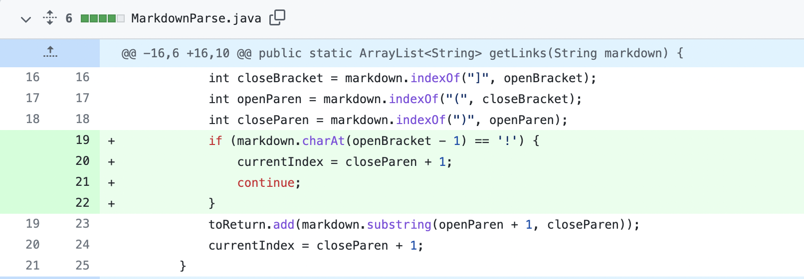
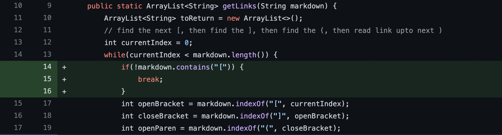
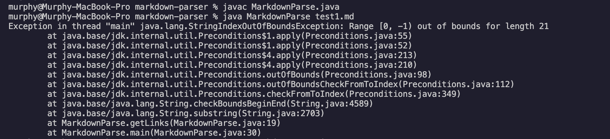
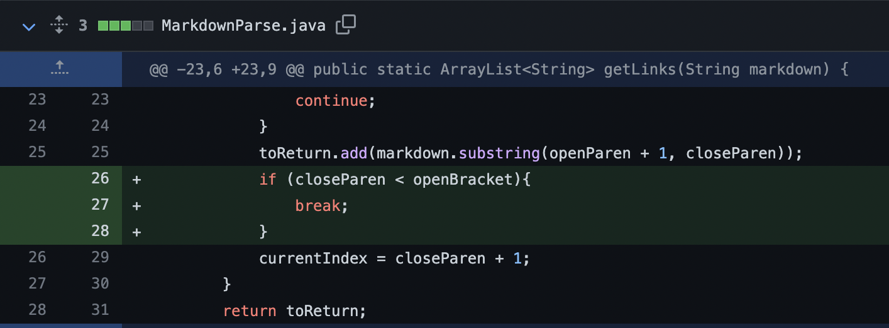
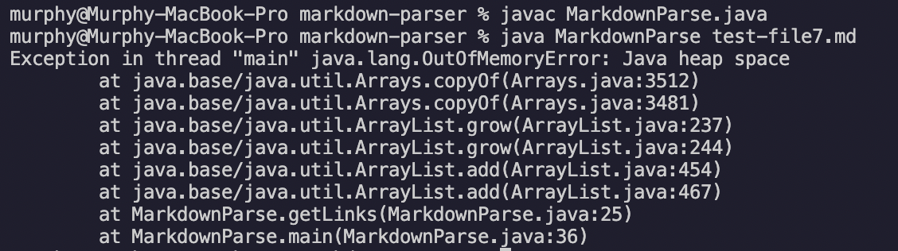

# Lab Report 2 -- Fixing Bugs
*** 
## Code change 1
This is the changed code that prevents the image link from being printed: (We added some code to skip the image link with a "!" at the begining.)

This is the link to the file that cause failure-inducing input (including the image link): [test1](https://github.com/murph77/Lab_report_2/blob/main/test-file.md) 

This is the output of the failling version: (It is expected to only print out the URLs but not the image link, while it printed out the image link as well) 

The bug in this case is that the program did not consider all of the situations with a link so it was not able to differentiate the link for an image from the link for a website. The symptom here is that the program output the unwanted image link. And the failure-inducing input is including an image in the test file.

*** 
## Code change 2
This is the changed code that fix the `StringIndexOutOfBoundsException` when a file contains no links. (We break the loop if "[" is not detected.)

This is the link to the file that cause failure-inducing input (does not include any links): [test2](https://github.com/murph77/markdown-parser/blob/main/test1.md) 

This is the output of the failling version: (Throw a `StringIndexOutOfBoundsException`)

The bug in this case is that when no link is contained in a file, the program will still try to find the index of "[" which can't be found. The symptom here is throwing a `StringIndexOutOfBoundsException` and the program cannot be compiled. The failure-inducing input is including no links in the file. 

*** 
## Code change 3
This is the changed code that fix the `OutOfMemoryError` (infinite loop) when a file does not contain a close parenthesis after brackets. (We break the loop if close parenthesis index < open bracket index)

This is the link to the file that cause failure-inducing input (contain a close parenthesis before open brackets): [test3](https://github.com/murph77/markdown-parser/blob/main/test-file7.md) 

This is the output of the failling version: (Throw a `OutOfMemoryError`)

The bug in this case is that when the file does not contain a close parenthesis after brackets or the close parenthesis is before the bracket, the program will enter an infinite loop. The sympotm is throwing a `OutOfMemoryError` and the program cannot be compiled. The failure-inducing input is having no close parenthesis after the bracket or the close parenthesis is before, so the `currentIndex` will be updated to a smaller number when the `closeParen` is before `openBracket` and enter an infinite loop. 
