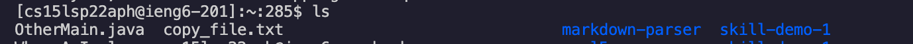
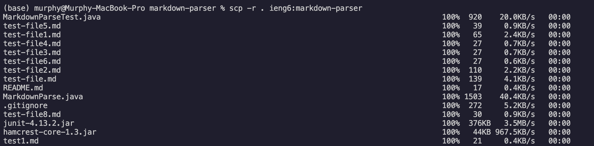
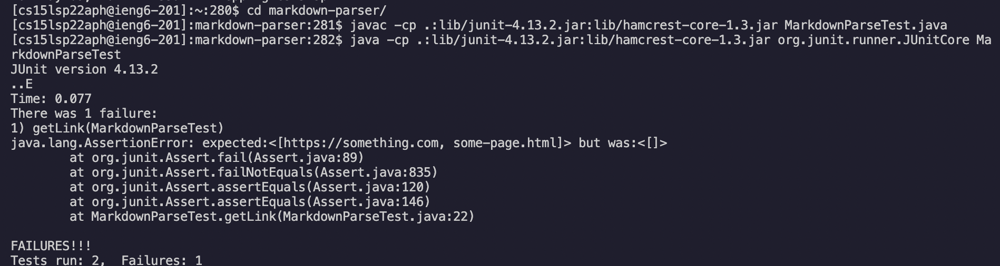
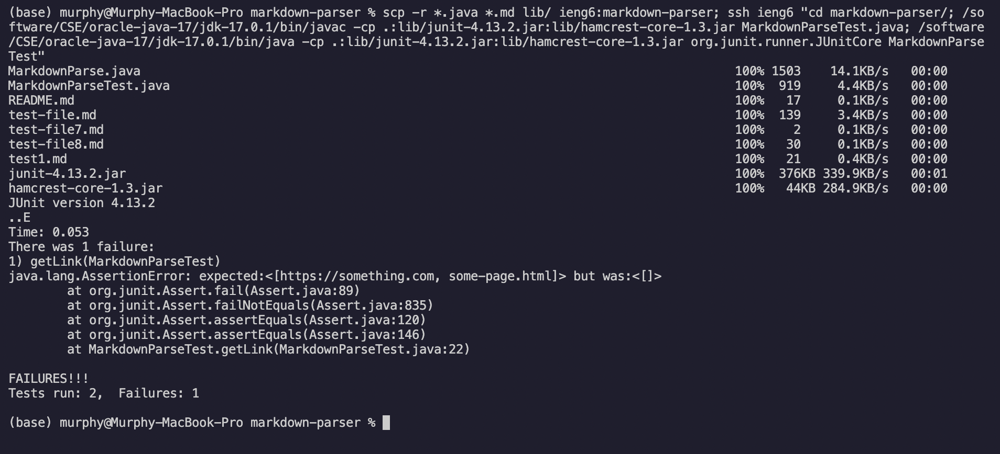

# Lab Report 3 -- More ieng6 Remote Operation

## Streamlining ssh Configuration
To streamline ssh configuration, we need to first create a `.ssh/config` file, I did it on VScode as shown below: 

 

Then, we can get rid of the long username and just login with the command `ieng6`: 

 

We can also use `scp` to copy a file to our ieng6 account without typing the whole username: 

 
 

***

## Setup Github Access from ieng6

Firstly, create new keys using `ssh-keygen`: 

 

We can see that the private and public keys are stored in `~/.ssh` as `id_rsa_github` and `id_rsa_github.pub` as shown below:

 

Follow the instruction [here](https://docs.github.com/en/authentication/connecting-to-github-with-ssh/adding-a-new-ssh-key-to-your-github-account) to add the public key to Github: 

 

In addition, we also need to add our keys to the ssh-agent (ignore the markerdown-parser directory): 
 
 

After these are set up, we can finally commit and push changes to Github. Let's add a comment to `MarkdownParser.java` file using `nano` and `cat` command: 

 
 

Then, we can commit and push the change using the command `git add .`, `git commit -m ""`, and `git push`: 

Here is the [resulting commit](https://github.com/murph77/markdown-parser/blob/main/MarkdownParse.java) .

***

## Copy whole directories with `scp -r`

To copy the whole current directory to the remote server, we can use the command `scp -r . ieng6:directoryname` as shown below: 

To compile and run the tests on the remote server, we can login using `ssh ieng6` first, change to the `markdown-parser directory`, then use the command `javac -cp .:lib/junit-4.13.2.jar:lib/hamcrest-core-1.3.jar MarkdownParseTest.java` and `java -cp .:lib/junit-4.13.2.jar:lib/hamcrest-core-1.3.jar org.junit.runner.JUnitCore MarkdownParseTest` to compile and run the file: 

To make the process easier, we also can combine all of the command into one line:
`scp -r *.java *.md lib/ ieng6:markdown-parser; ssh ieng6 "cd markdown-parser/; /software/CSE/oracle-java-17/jdk-17.0.1/bin/javac -cp .:lib/junit-4.13.2.jar:lib/hamcrest-core-1.3.jar MarkdownParseTest.java; /software/CSE/oracle-java-17/jdk-17.0.1/bin/java -cp .:lib/junit-4.13.2.jar:lib/hamcrest-core-1.3.jar org.junit.runner.JUnitCore MarkdownParseTest"`

***
### End of Lab Report 3.

