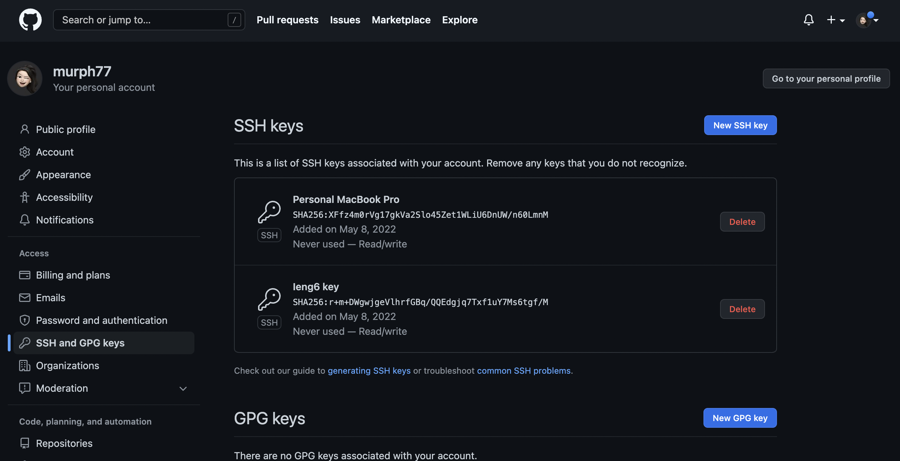

# Lab Report 3 -- More ieng6 Remote Operation

## Streamlining ssh Configuration
To streamline ssh configuration, we need to first create a `.ssh/config` file, I did it on VScode as shown below: 

 

Then, we can get rid of the long username and just login with the command `ieng6`: 

 

We can also use `scp` to copy a file to our ieng6 account without typing the whole username: 

 

***

## Setup Github Access from ieng6

Firstly, create new keys using `ssh-keygen`: 

 

We can see that the private and public keys are stored in `~/.ssh` as `id_rsa_github` and `id_rsa_github.pub` as shown below:

 

Follow the instruction [here](https://docs.github.com/en/authentication/connecting-to-github-with-ssh/adding-a-new-ssh-key-to-your-github-account) to add the public key to Github: 

 

In addition, we also need to add our keys to the ssh-agent: 
 
 

After these are set up, we can finally commit and push changes to Github. Let's add a comment to `MarkdownParser.java` file using `nano` and `cat` command: 

 
 

Then, we can commit and push the change using the command `git add .`, `git commit -m ""`, and `git push`: 

Here is the [resulting commit](https://github.com/murph77/markdown-parser/blob/main/MarkdownParse.java) .

