# Lab Report 4 -- More MarkdownParse Tests

## - Links
[markdown-parse](https://github.com/murph77/markdown-parse-lab-report-4/tree/main/markdown-parse-new)

[markdown-parse-reviewed](https://github.com/murph77/markdown-parse-lab-report-4/tree/main/markdown-parser-reviewed)

## - Snippet 1
### Expected outputs are three links:
`'google.com`,`google.com`,`ucsd.edu` 

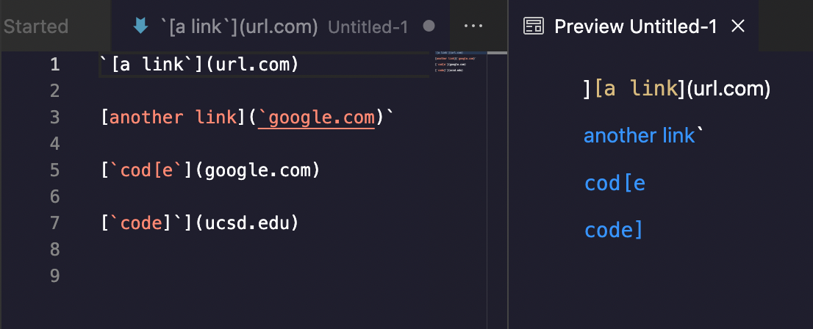

### Test
(typo: the second expected outcome is google.com instead of google.come, but doesn't make any difference to the failing result here)

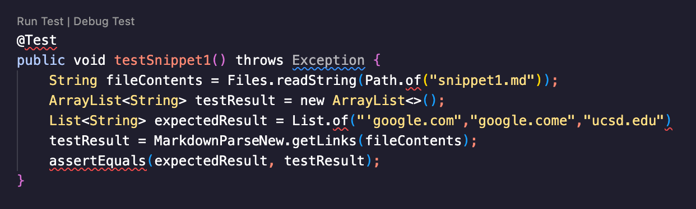

### Test output of my implementation
The test failed as shown:

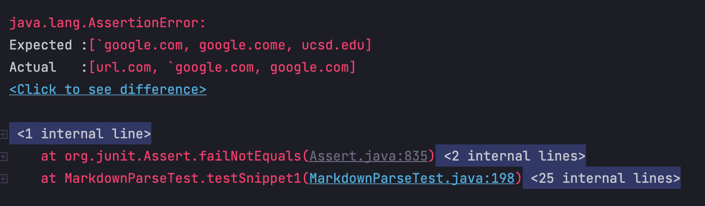

### Test output of reviewed implementation
The test failed as shown: 

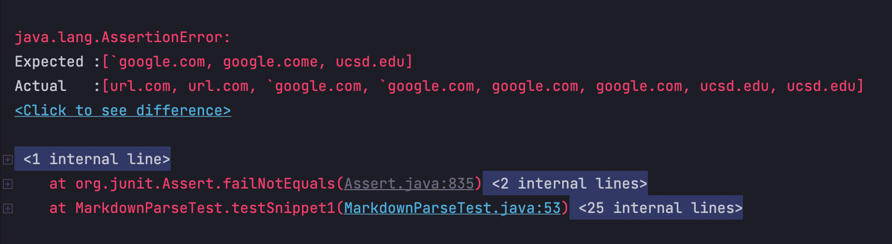

### Change can be made
Since the \`\` symbol has a higher priority to be parsed, any `[` `]` `(` `)` within \`\` will not run as expected. We can first check if there still exists a pair of `[]` after we removed the content inside \`\`, if so we can print out the content within `()`, else we skip that line. 

## - Snippet 2

### Expected outputs are three links: 
`a.com`,`a.com(())`,`example.com`

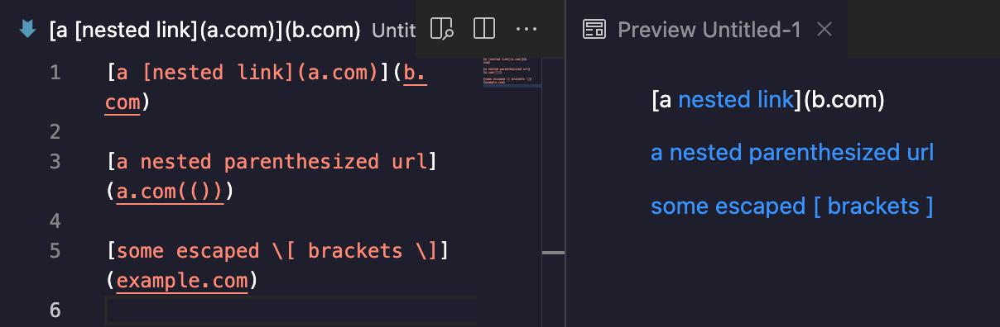

### Test
(typo: the second expected outcome is a.com instead of a.come, but doesn't make any difference to the failing result here)

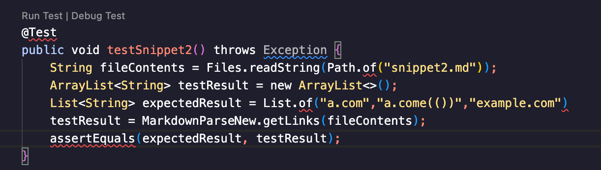

### Test output of my implementation
The test failed as shown: 

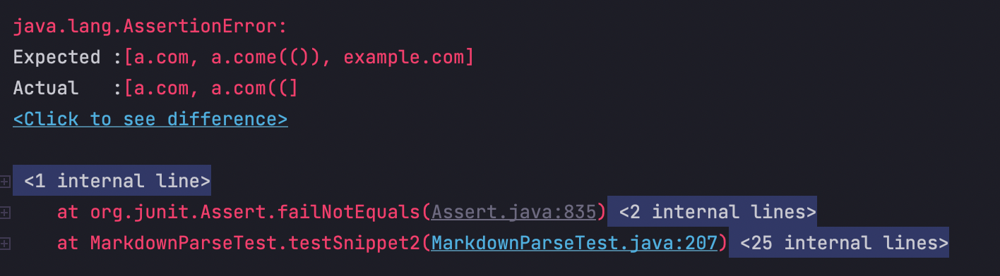

### Test output of reviewed implementation
The test failed as shown:

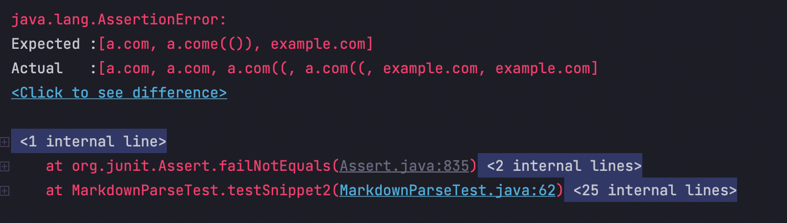

### Change can be made
For the second line, we can add a function that counts the `(` and `)`, count +1 everytime a`(` appears and -1 when `)` appears, the output should be the content before when the count = 0. For the thrid line, we can remove anything that's 1 index after `\`, and if there's still a pair of '[]' exist, we output the content within `()`. 

## - Snippet 3

### Expected outputs is the link: 
`https://sites.google.com/eng.ucsd.edu/cse-15l-spring-2022/schedule`

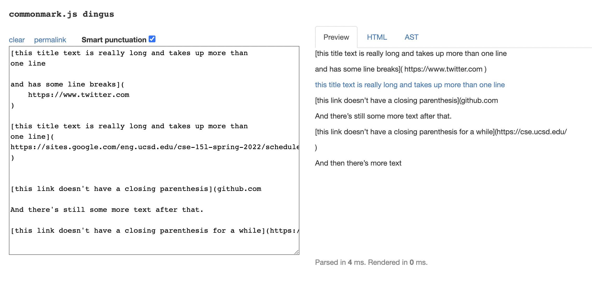

### Test

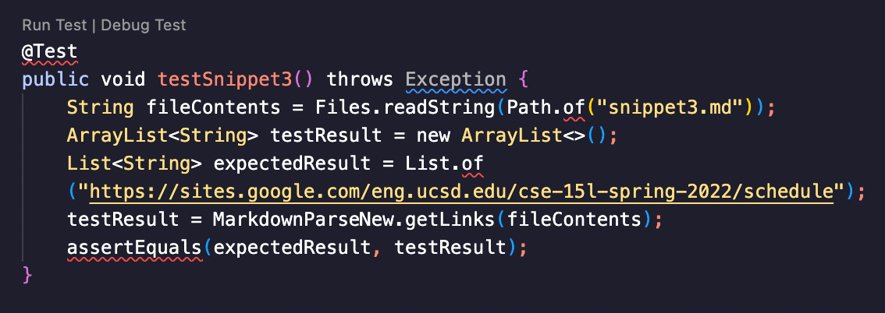

### Test output of my implementation
The test failed as shown:

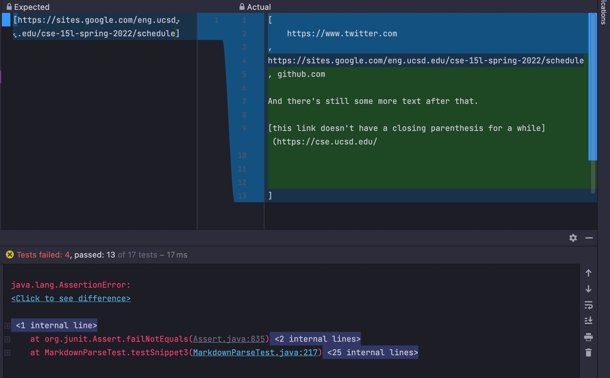

### Test output of reviewed implementation
The test failed as shown:

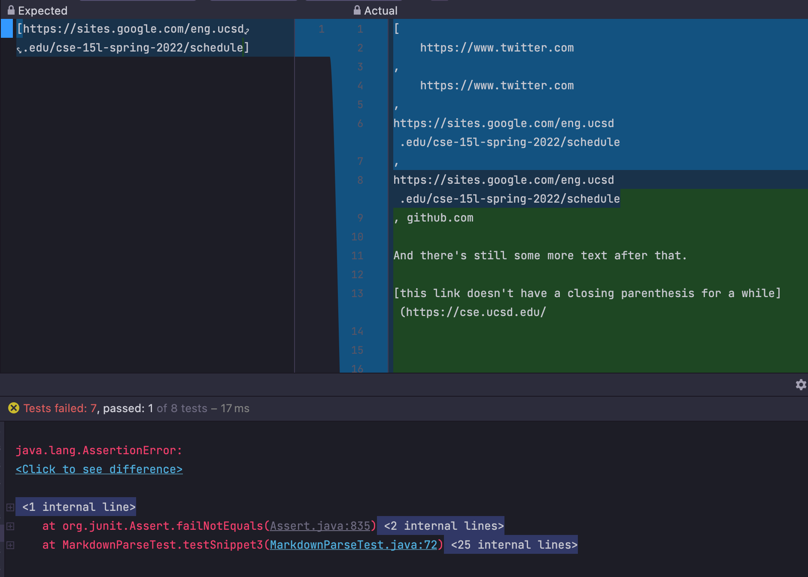

### Change can be made
We can check if there are newlines within `[]` or `()`, if so, we skip that line, else we print out the content within `()`. 

