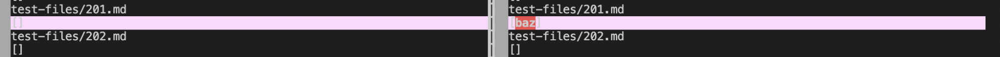
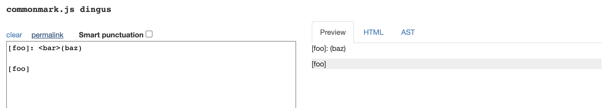
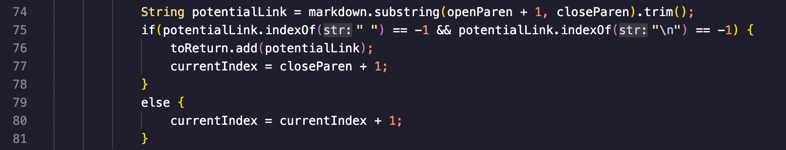
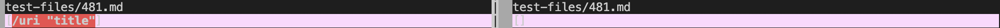
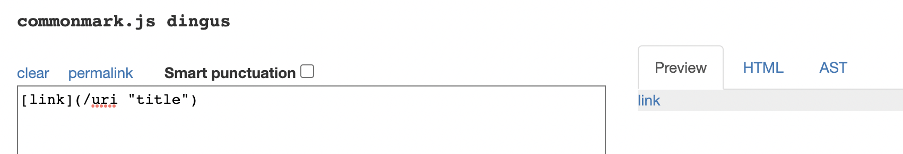

# Lab Report 5 -- Use Vim to compare files

## - Find the output difference 
To find the tests with different results, I first use `bash script.sh > results.txt` to make the test output in both my markdown-parse and the given markdown-parse a txt file, and then used the command `vimdiff markdown-parser-group/results.txt markdown-parser/results.txt` to compare the results. 

## - Test 1
The first different result I found is [test201](https://github.com/nidhidhamnani/markdown-parser/blob/main/test-files/201.md?plain=1).

The comparison of the output of our implementation (left) and given implemention (right) is as below: 

According to CommonMark, the correct out put should be `[]` because there is no link in it: 

Thus, our implementation is correct as it outputs an empty `[]` while the given implementation is wrong as it outputs `baz`. The part that causes the incorrect outputs is as shown below (line 74-76): 

Since the given implementation outputs the content `baz` which is within the parenthesis, we can know that it mistook any content that has no space and `\n` within `()` as a link. And another problem is that the program didn't check for `<>` as it should, because if `<>` is checked the program will know that `baz` is not a link. 

## - Test 2
The second different result I found is [test481](https://github.com/nidhidhamnani/markdown-parser/blob/main/test-files/481.md?plain=1).

The comparison of the output of our implementation (left) and given implemention (right) is as below: 

According to CommonMark, the correct out put should be a link named `/uri "title"` as shown: 

Thus, our implementation is correct as it prints the correct link name `/uri "title"`, while the given implementation outputs an empty `[]`. The part that causes the incorrect outputs is the same as last one (line 75-76): 

 

In this implementation it does not allow any space but the actual link `/uri "title"` that we need to print out does contain a space and it is actually valid, meaning that containing space should not be a condition that prevent the link from being printed. 

