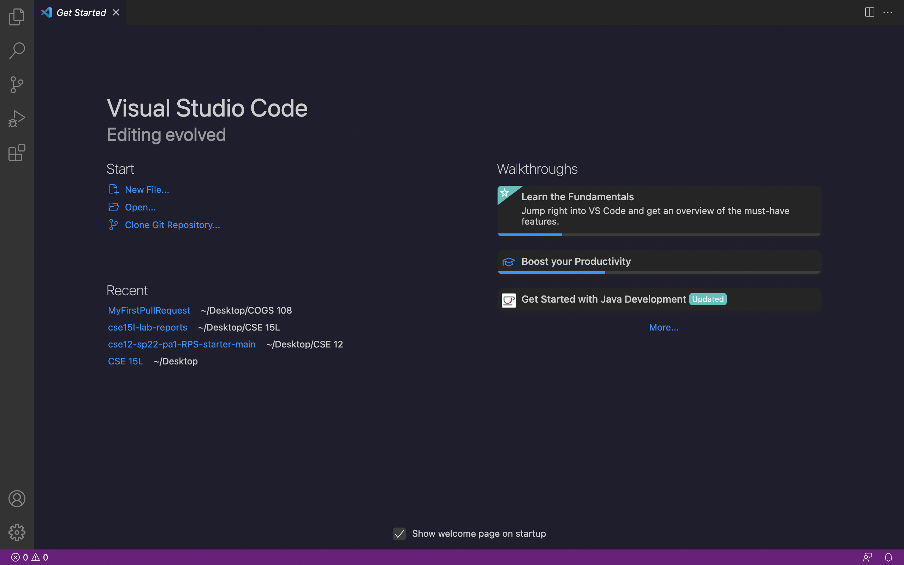
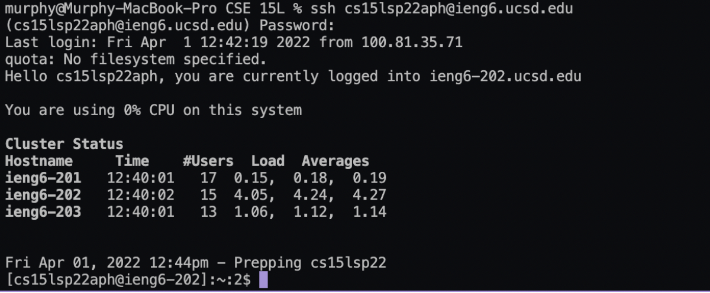
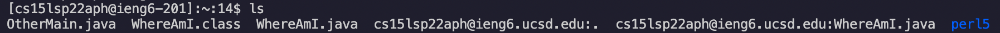
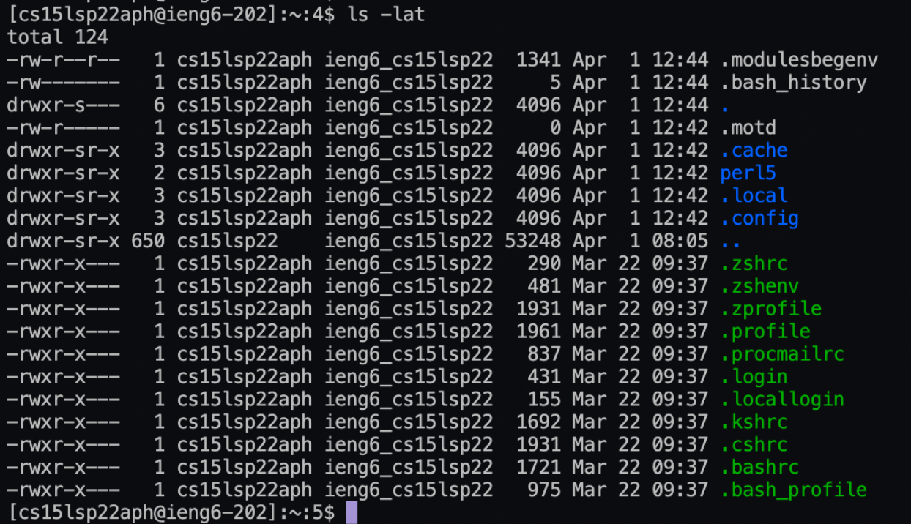
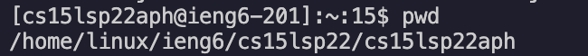
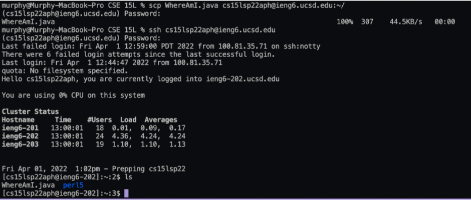
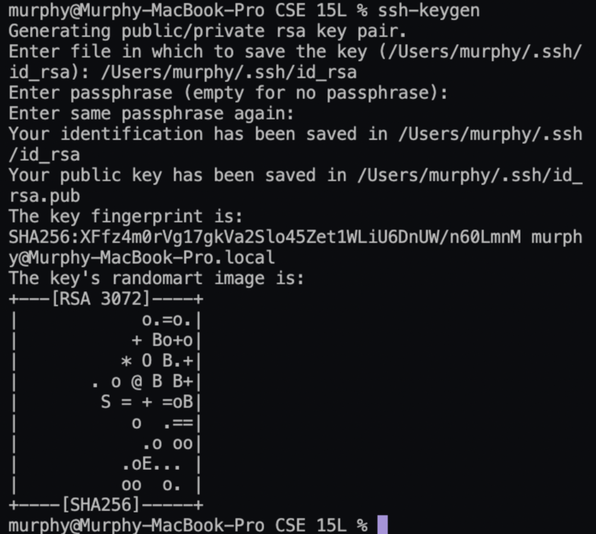
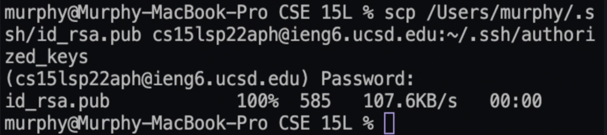
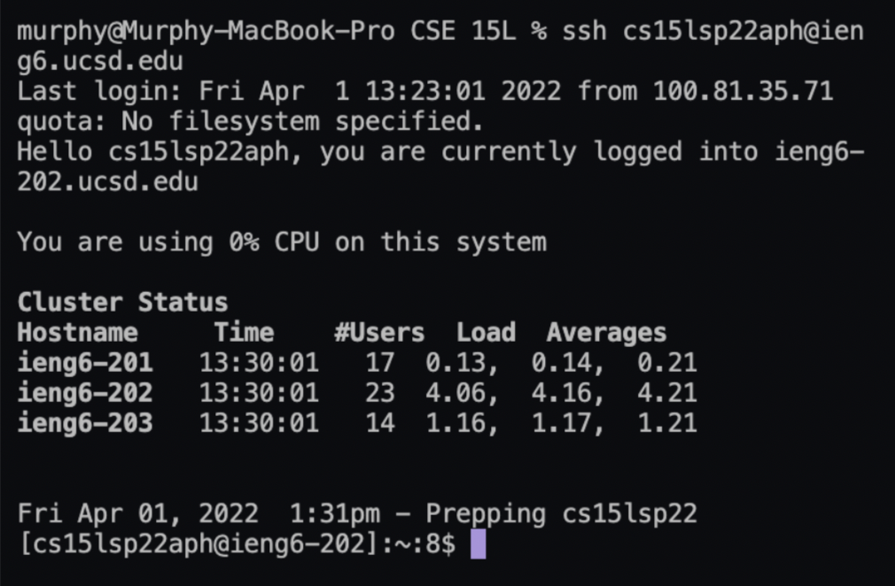

This is a tutorial about how to set your computer up for remote access to the CSE lab computers and log into a course-specific account on `ieng6`.

***

### **Step 1: Installing VScode**
Go to the Visual Studio Code website https://code.visualstudio.com/ and download the Visual Studio Code application. After installing and openning the VScode, you should see a window like this: 

***

### **Step 2: Remotely Connecting**
We will need to connect our local machine to a remote computer over the internet to do work there. 

- (**If you are on Windows:** You'll need to first install a program called [OpenSSH](https://docs.microsoft.com/en-us/windows-server/administration/openssh/openssh_install_firstuse)).

- Log in to https://sdacs.ucsd.edu/~icc/index.php to look up your course-specific account which should be something like `cs15lsp22zz@ieng6.ucsd.edu` and reset your password. 

- Then open a terminal in VScode (Top menu bar -> Terminal -> New Terminal), and type in the command `ssh cs15lsp22zz@ieng6.ucsd.edu` (use your own account from previous step).

- The system might ask `Are you sure you want to continue connecting` if you are connecting to a new server for the first time, enter `yes`. Then type in your password when prompted (sometimes you need to enter more than 3 times to pass through). 

- The whole process should be something look like this: 
 

Now your local machine becomes a *client* that are connected to a *server* computer in the CSE basement! 

*** 

### **Step 3: Trying Some Commands** 
After connecting to the server computer, any command you run on your local machine will run on the server! 

You can try to run some commands such as `cd`, `ls`, `pwd`, `mkdir`, and `cp` on your local computer and remote server to see their difference. 

- For example, running the command `ls` will list all files (not including the hidden files) that are in the current directory: 

    

- Running the command `ls -lat` on the remote server will allow you to see the list of all files including the hidden files in the directory sorted by date: 

     

- Running the command `pwd` will print the path of your current working directory: 

    

*** 

### **Step 4: Moving Files with scp** 
You can also copy files from your local computer to the remote server computer by using the command `scp` on your local machine. 

For example, to copy a local file `WhereAmI.java` to the server, run the command `scp WhereAmI.java cs15lsp22zz@ieng6.ucsd.edu:~/` (change to your own account) on your local computer, and enter your password when prompted. Then, log in to ieng6 again and use the command `ls`, you'll see the new file is moved to the remote sever! The whole process should look like this: 

*** 

### **Step 5: Setting an SSH Key** 
To avoid typing password repetiively, we can create a ssh key. 

- Use the command `ssh-keygen` on your local computer
- When asked where to save the key, type in `/Users/<user-name>/.ssh/id_rsa`(your user name)  
- When promted to enter passphrase, **DO NOT** enter anything
- (**If you are on Windows, do the extra steps here:** https://docs.microsoft.com/en-us/windows-server/administration/openssh/openssh_keymanagement#user-key-generation )
- Then both a public key (in `id_rsa.pub`) and a private key (in `id_rsa`) will be created and you will see a random image for your key
- The whole process should look like this: 

    

- Then we need to copy the *public key* to the `.ssh` directory. On your local computer, type `scp /Users/<user-name>/.ssh/id_rsa.pub cs15lsp22zz@ieng6.ucsd.edu:~/.ssh/authorized_keys` (change to your username and account). The process looks like this: 

    

- After that, you should be able to login to the remote server and do work without entering the password: 
 
    

*** 

### **Step 6: Optimizing Remote Running** 
We can also make local edit on a file on the remote server.

- First, you need to copy the file from the remote server to your local computer using the command: `scp cs15lsp22aph@ieng6.ucsd.edu:WhereAmI.java WhereAmI.java` (use your account and the name of the file that you are copying).

- Then, you can edit the file downloaded on your computer and save your changes.

- Next, you need to copy back the editted file from the client to server and run the file on the server using the command `scp WhereAmI.java cs15lsp22aph@ieng6.ucsd.edu:~/; ssh cs15lsp22aph@ieng6.ucsd.edu "javac WhereAmI.java; java WhereAmI"` (use your account and the name of the file that you are copying).

- For example, I added a line "Hello" to my WhereAmI.java file locally and run it remotely, the whole process looks like this: 

    

*** 

### End of Lab Report 1
